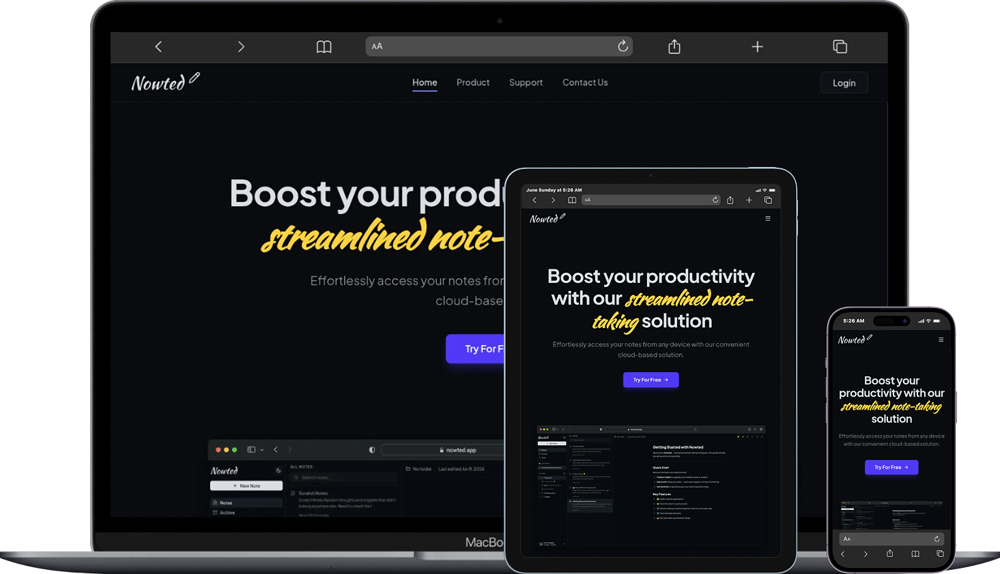

# Nowted Web Frontend


A premium, full-featured note-taking frontend built with React 19, TypeScript, Vite, and Tailwind CSS v4.

---

## 🔗 Quick Navigation & Links

**Project Resources**

- 🚀 **[Live Demo]()**
- 📄 **[API Docs]()**

**Monorepo Packages**

- 💻 **[Frontend SPA (React 19)](./)**
- ⚙️ **[Backend API (Express 5)](../api)**
- 📁 **[Monorepo Root](../../)**

---

## 📷 Preview



---

## 📝 Overview

**Nowted Web** is a premium, full-featured client interface designed for an immersive note-taking experience. It showcases production-ready frontend patterns, utilizing a **Feature-First Architecture** to keep the codebase highly modular and maintainable.

The application is optimized for performance and developer experience, featuring lazy-loaded heavy modules (like the TipTap editor), type-safe form validations via TanStack Form + Zod, and a seamless automatic token refresh flow to ensure users are never interrupted during writing sessions.

---

## ✨ Key Features

| Feature                          | Description                                                                                                                                                                      |
| -------------------------------- | -------------------------------------------------------------------------------------------------------------------------------------------------------------------------------- |
| 🔒 **Secure Authentication**     | Registration, login, and protected routes with automatic JWT refresh via `axios-auth-refresh` for seamless, session-persistent UX.                                               |
| 📝 **Rich Text Editor**          | Full-featured WYSIWYG editor powered by **Tiptap**, storing notes as structural JSON. Supports formatting, float toolbar, and native Markdown (.md) import parsing via `marked`. |
| 📂 **Notes CRUD + Organization** | Create, update, soft-delete, and restore notes. Notes are dynamically grouped into **Folders**, **Favorites**, **Archive**, and **Trash**.                                       |
| 🔍 **Debounced Search**          | Instantly query notes by title or content, using a custom `useDebounce` hook to throttle API calls and optimize performance.                                                     |
| 🖼️ **Image Uploading**           | Upload images directly inside the editor or on the user profile page via multipart `FormData` integration with the backend API.                                                  |
| 🌙 **Dark Mode**                 | Full system-aware dark/light theme support via `next-themes`, persisted across sessions.                                                                                         |
| ⚡ **Optimistic UI**             | Instant feedback on mutations using TanStack Query's optimistic update pattern for a native-app feel.                                                                            |

---

## 🛠️ Tech Stack

### Core

| Technology                                      | Role                                                                 |
| ----------------------------------------------- | -------------------------------------------------------------------- |
| [React 19](https://react.dev/)                  | UI rendering with Hooks, Suspense, and `React.lazy` code-splitting   |
| [TypeScript 6](https://www.typescriptlang.org/) | Strict typing across the entire codebase                             |
| [Vite 8](https://vite.dev/)                     | Lightning-fast HMR dev server and optimized Rollup production builds |

### Styling & UI

| Technology                                  | Role                                                              |
| ------------------------------------------- | ----------------------------------------------------------------- |
| [Tailwind CSS v4](https://tailwindcss.com/) | Utility-first styling via the new `@tailwindcss/vite` integration |
| [shadcn/ui](https://ui.shadcn.com/)         | Accessible, headless-first component primitives                   |
| [Lucide React](https://lucide.dev/)         | Consistent, modern icon set                                       |
| [Sonner](https://sonner.emilkowal.ski/)     | Elegant toast notifications                                       |

### Data & State Management

| Technology                                                                                               | Role                                                                                |
| -------------------------------------------------------------------------------------------------------- | ----------------------------------------------------------------------------------- |
| [TanStack Query v5](https://tanstack.com/query)                                                          | Server-state management with caching, background refetching, and optimistic updates |
| [TanStack Router](https://tanstack.com/router)                                                           | Fully type-safe, file-based routing with search-param validation                    |
| [TanStack Form](https://tanstack.com/form)                                                               | Headless, performant form state management                                          |
| [Zod v4](https://zod.dev/)                                                                               | Runtime schema validation for all user inputs                                       |
| [Axios](https://axios-http.com/) + [`axios-auth-refresh`](https://github.com/Flyrell/axios-auth-refresh) | HTTP client with automatic JWT token refresh interceptors                           |

### Editor

| Technology                       | Role                                          |
| -------------------------------- | --------------------------------------------- |
| [Tiptap v3](https://tiptap.dev/) | Extensible ProseMirror-based rich text editor |

### Testing

| Technology                                            | Role                                         |
| ----------------------------------------------------- | -------------------------------------------- |
| [Vitest](https://vitest.dev/)                         | Vite-native unit and integration test runner |
| [React Testing Library](https://testing-library.com/) | User-centric component testing               |
| [jsdom](https://github.com/jsdom/jsdom)               | Simulated DOM environment for headless tests |

---

## 🏗️ Architecture Highlights

### 1. Feature-First Directory Structure

Code is organized by **domain** rather than by file type, making the codebase highly scalable and easy to navigate. Each feature is a self-contained module.

```
src/
├── features/
│   ├── auth/           # Login, register, protected route logic
│   │   ├── api/        # API call functions
│   │   ├── components/ # Form and UI components
│   │   ├── hooks/      # useMutation / useQuery wrappers
│   │   ├── schemas/    # Zod validation schemas
│   │   └── types/      # TypeScript interfaces
│   ├── notes/          # Note CRUD, editor, item display
│   ├── folders/        # Folder sidebar and management
│   └── users/          # User profile, avatar upload
├── shared/
│   ├── components/     # Reusable UI primitives (Button, Modal, etc.)
│   ├── hooks/          # Generic hooks (useDebounce, useIsMobile)
│   └── lib/            # Utilities, API client, error parser
└── app/                # Root layout, router, global providers
```

### 2. Performance-First Code Splitting

The heavy **Tiptap** rich-text editor bundle (~400 kB) is lazy-loaded using `React.lazy` and only downloaded when a user actually opens a note for editing. This keeps the initial bundle lean and the dashboard load near-instant.

### 3. Automatic Token Refresh (Zero-Logout UX)

Rather than redirecting the user to login on a 401 response, the app uses `axios-auth-refresh` to silently request a new access token in the background, queue all failed requests, and replay them automatically — with zero user interruption.

### 4. Colocated Testing Strategy

Test files live **next to the source files they cover** (e.g., `login-form.test.tsx` beside `login-form.tsx`). This eliminates import path fragility and ensures that refactoring or deleting a module naturally includes its tests.

---

## 🧪 Testing

```
Test Files  7 passed (7)
     Tests  30 passed (30)
  Coverage  100% on targeted files
```

- **Unit Tests** — `utils.ts`, `error-parser.ts`, `useDebounce`, `useIsMobile`
- **Integration Tests** — Full form rendering, validation, and submission flows (`login-form`, `note-item`, `folder-list`)

---

## ⚙️ Local Setup

### Prerequisites

- [Node.js](https://nodejs.org/) >= 20
- [pnpm](https://pnpm.io/) >= 9 (this project uses pnpm workspaces)

### 1. Clone the Repository

```bash
git clone https://github.com/imanmaulana1/nowted.git
cd nowted
```

### 2. Install Dependencies

Install from the **monorepo root** to resolve all workspace dependencies:

```bash
pnpm install
```

### 3. Configure Environment Variables

```bash
cd apps/web
cp .env.example .env
```

Open `.env` and set the API base URL:

```env
VITE_API_URL="http://localhost:5000"
```

### 4. Start the Development Server

From the **workspace root**:

```bash
pnpm --filter nowted-web dev
```

Or from `apps/web` directly:

```bash
pnpm dev
```

Open [http://localhost:5173](http://localhost:5173) in your browser.

### 5. Other Useful Scripts

Run all commands from the `apps/web` directory:

```bash
pnpm build             # Compile and bundle for production
pnpm preview           # Preview the production build locally
pnpm lint              # Run ESLint static analysis
pnpm test              # Run the full test suite once
pnpm test:watch        # Run tests in interactive watch mode
pnpm test:coverage     # Run tests and generate a coverage report
```
